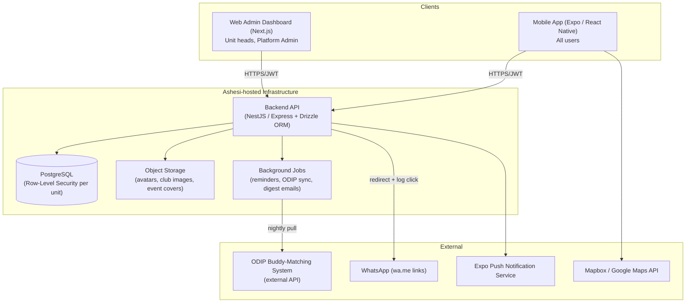
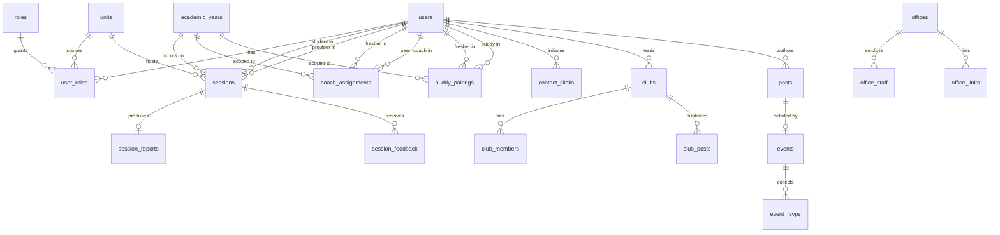

# Fresher Hub — Architecture, Database, Roadmap & Execution Plan

**Stack decisions locked in:** PostgreSQL (self-hosted on an Ashesi University server, for data-security/compliance reasons), Expo (React Native) for mobile, unified single-profile-per-user model with multiple roles attached. Target: **4-week build**, incremental, testable at every step.

---

## 1. Core Data Philosophy: Unified Profile

Every person is **one row in `users`**, created once (via the Ashesi IT/admissions data import), and student identity lives in a separate student profile that carries the `school_id` plus the student-specific fields. **Every user starts from the imported identity source, but the `school_id` itself exists only for students.** Additional roles (`peer_coach`, `coach_admin`, `club_lead`, `staff`, etc.) are _added on top_ of that base identity, never replacing it — a club lead is still a student underneath, a peer coach is still a student underneath. This is what makes multi-role support low-friction: no separate signup, no separate account, no separate app experience — just more rows in `user_roles`.

This decision drives the entire schema below: roles are additive metadata on a single identity, not a fork in identity.

---

## 2. System Architecture

### 2.1 High-level diagram



### 2.2 Why this shape

- **Single backend API, two frontends** (mobile + web), same auth, same permission rules — no duplicated business logic.
- **PostgreSQL with Row-Level Security (RLS)** enforces unit confidentiality _in the database itself_, not just in application code. Even a bug in the API layer cannot leak a Coaching report to a Counselling head, because Postgres itself refuses the row.
- **Background job runner** handles the things that must happen without a user present: nightly ODIP pairing sync, session reminder pushes, mandatory-session compliance recalculation.
- **WhatsApp bridge as a redirect, not a raw link** — the API logs the "contact" click, then 302-redirects to `wa.me`, which is how click-tracking becomes possible without building chat.

### 2.3 Authentication

- Accounts are **pre-provisioned**, not self-registered — imported from the admissions/IT dataset (`email`, `full_name`, `class_year`, `country`, `major`), with student-only `school_id` data stored in a dedicated profile table.
- First login: user verifies their Ashesi email (magic link or OTP) and sets a password/PIN. No open signup form — the email must already exist in `users` from the import, closing off outside registration.
- JWT-based sessions, short-lived access token + refresh token, standard for a mobile + web split.

---

## 3. Database Schema (PostgreSQL)

Below is the full schema, grouped by domain. `uuid` primary keys throughout for safety across distributed inserts (mobile offline queues, imports, etc.).

### 3.1 Identity & Roles

```sql
CREATE TABLE users (
    id              UUID PRIMARY KEY DEFAULT gen_random_uuid(),
    email           TEXT UNIQUE NOT NULL,
    full_name       TEXT NOT NULL,
    phone           TEXT,
    class_year      INT,               -- e.g. 2029 (graduation year)
    country         TEXT,
    major           TEXT,
    avatar_url      TEXT,
    is_active       BOOLEAN NOT NULL DEFAULT true,
    created_at      TIMESTAMPTZ NOT NULL DEFAULT now(),
    updated_at      TIMESTAMPTZ NOT NULL DEFAULT now()
);

CREATE TABLE roles (
    id      SERIAL PRIMARY KEY,
    name    TEXT UNIQUE NOT NULL   -- student, peer_coach, coach_admin, counselling_head,
                                    -- advisor, odip_head, staff, faculty,
                                    -- student_leader, club_lead, platform_admin
);

CREATE TABLE units (
    id      SERIAL PRIMARY KEY,
    name    TEXT UNIQUE NOT NULL   -- coaching, counselling, advising, buddy_up, clubs, platform
);

-- Every user gets 'student' automatically at import time.
-- Additional roles are added on top, optionally scoped to a unit.
CREATE TABLE user_roles (
    id          UUID PRIMARY KEY DEFAULT gen_random_uuid(),
    user_id     UUID NOT NULL REFERENCES users(id) ON DELETE CASCADE,
    role_id     INT NOT NULL REFERENCES roles(id),
    unit_id     INT REFERENCES units(id),          -- NULL for global roles (e.g. platform_admin)
    assigned_by UUID REFERENCES users(id),
    assigned_at TIMESTAMPTZ NOT NULL DEFAULT now(),
    UNIQUE (user_id, role_id, unit_id)
);

CREATE TABLE academic_years (
    id          SERIAL PRIMARY KEY,
    label       TEXT UNIQUE NOT NULL,   -- '2026/2027'
    start_date  DATE NOT NULL,
    end_date    DATE NOT NULL,
    is_current  BOOLEAN NOT NULL DEFAULT false
);
```

### 3.2 Support Units — Coaching / Counselling / Advising (shared shape)

All three units reuse the same `sessions` / `session_reports` / `session_feedback` tables, distinguished by `unit_id`. Coaching additionally uses `coach_assignments` for the mandatory peer-pairing; Counselling and Advising skip that table since there's no mandatory pairing.

```sql
CREATE TABLE coach_assignments (
    id                UUID PRIMARY KEY DEFAULT gen_random_uuid(),
    academic_year_id  INT NOT NULL REFERENCES academic_years(id),
    fresher_id        UUID NOT NULL REFERENCES users(id),
    peer_coach_id     UUID NOT NULL REFERENCES users(id),
    assigned_by       UUID NOT NULL REFERENCES users(id),  -- Coach Yvonne
    created_at        TIMESTAMPTZ NOT NULL DEFAULT now(),
    UNIQUE (academic_year_id, fresher_id, peer_coach_id)
);

CREATE TYPE session_status AS ENUM ('booked', 'completed', 'cancelled', 'rescheduled', 'no_show');
CREATE TYPE session_with AS ENUM ('peer_coach', 'unit_head');  -- e.g. peer coach vs Coach Yvonne directly

CREATE TABLE sessions (
    id                UUID PRIMARY KEY DEFAULT gen_random_uuid(),
    unit_id           INT NOT NULL REFERENCES units(id),      -- coaching / counselling / advising
    academic_year_id  INT NOT NULL REFERENCES academic_years(id),
    student_id        UUID NOT NULL REFERENCES users(id),
    provider_id       UUID NOT NULL REFERENCES users(id),     -- peer coach, counsellor, or advisor
    with_type         session_with,                           -- NULL for counselling/advising (n/a)
    scheduled_at      TIMESTAMPTZ NOT NULL,
    location          TEXT,
    status            session_status NOT NULL DEFAULT 'booked',
    is_mandatory      BOOLEAN NOT NULL DEFAULT false,
    created_at        TIMESTAMPTZ NOT NULL DEFAULT now(),
    updated_at        TIMESTAMPTZ NOT NULL DEFAULT now()
);

CREATE TABLE session_reports (
    id           UUID PRIMARY KEY DEFAULT gen_random_uuid(),
    session_id   UUID NOT NULL UNIQUE REFERENCES sessions(id) ON DELETE CASCADE,
    provider_id  UUID NOT NULL REFERENCES users(id),
    template_id  UUID REFERENCES report_templates(id),
    content      JSONB NOT NULL,       -- structured answers matching the template
    submitted_at TIMESTAMPTZ NOT NULL DEFAULT now()
);

CREATE TABLE report_templates (
    id          UUID PRIMARY KEY DEFAULT gen_random_uuid(),
    unit_id     INT NOT NULL REFERENCES units(id),
    name        TEXT NOT NULL,
    schema      JSONB NOT NULL,        -- field definitions: [{key, label, type}]
    is_active   BOOLEAN NOT NULL DEFAULT true
);

CREATE TABLE session_feedback (
    id           UUID PRIMARY KEY DEFAULT gen_random_uuid(),
    session_id   UUID NOT NULL REFERENCES sessions(id) ON DELETE CASCADE,
    student_id   UUID NOT NULL REFERENCES users(id),
    rating       SMALLINT CHECK (rating BETWEEN 1 AND 5),
    comment      TEXT,
    submitted_at TIMESTAMPTZ NOT NULL DEFAULT now()
);
```

> **Note on `report_templates` forward reference:** create `report_templates` before `session_reports` in actual migration order (shown here grouped by concept for readability).

### 3.3 Buddy Up (ODIP-sourced)

```sql
CREATE TABLE buddy_pairings (
    id                UUID PRIMARY KEY DEFAULT gen_random_uuid(),
    academic_year_id  INT NOT NULL REFERENCES academic_years(id),
    fresher_id        UUID NOT NULL REFERENCES users(id),
    buddy_id          UUID NOT NULL REFERENCES users(id),
    odip_ref_id       TEXT,             -- external ID from ODIP's system, for sync/dedupe
    synced_at         TIMESTAMPTZ NOT NULL DEFAULT now(),
    UNIQUE (academic_year_id, fresher_id, buddy_id)
);
```

### 3.4 WhatsApp Contact Tracking (shared across all units)

```sql
CREATE TABLE contact_clicks (
    id           UUID PRIMARY KEY DEFAULT gen_random_uuid(),
    initiator_id UUID NOT NULL REFERENCES users(id),
    target_id    UUID NOT NULL REFERENCES users(id),
    unit_id      INT REFERENCES units(id),     -- NULL if generic
    context      TEXT,                          -- 'buddy_up', 'coaching_peer', 'counselling', etc.
    clicked_at   TIMESTAMPTZ NOT NULL DEFAULT now()
);
```

### 3.5 Clubs

```sql
CREATE TABLE clubs (
    id           UUID PRIMARY KEY DEFAULT gen_random_uuid(),
    name         TEXT NOT NULL,
    description  TEXT,
    cover_url    TEXT,
    lead_id      UUID NOT NULL REFERENCES users(id),
    created_at   TIMESTAMPTZ NOT NULL DEFAULT now()
);

CREATE TABLE club_members (
    club_id    UUID NOT NULL REFERENCES clubs(id) ON DELETE CASCADE,
    user_id    UUID NOT NULL REFERENCES users(id) ON DELETE CASCADE,
    joined_at  TIMESTAMPTZ NOT NULL DEFAULT now(),
    PRIMARY KEY (club_id, user_id)
);

CREATE TYPE club_post_type AS ENUM ('announcement', 'event', 'update');

CREATE TABLE club_posts (
    id          UUID PRIMARY KEY DEFAULT gen_random_uuid(),
    club_id     UUID NOT NULL REFERENCES clubs(id) ON DELETE CASCADE,
    author_id   UUID NOT NULL REFERENCES users(id),
    type        club_post_type NOT NULL,
    content     TEXT NOT NULL,
    created_at  TIMESTAMPTZ NOT NULL DEFAULT now()
);
```

### 3.6 Feed, Groups & Events

```sql
CREATE TYPE post_type AS ENUM ('announcement', 'campus_update', 'event');
CREATE TYPE visibility_type AS ENUM ('public', 'targeted');

CREATE TABLE groups (
    id      UUID PRIMARY KEY DEFAULT gen_random_uuid(),
    name    TEXT NOT NULL,           -- 'Class of 2029', 'International Students', custom, etc.
    type    TEXT NOT NULL            -- 'class_year' | 'cohort' | 'custom'
);

CREATE TABLE group_members (
    group_id  UUID NOT NULL REFERENCES groups(id) ON DELETE CASCADE,
    user_id   UUID NOT NULL REFERENCES users(id) ON DELETE CASCADE,
    PRIMARY KEY (group_id, user_id)
);

CREATE TABLE posts (
    id          UUID PRIMARY KEY DEFAULT gen_random_uuid(),
    author_id   UUID NOT NULL REFERENCES users(id),
    type        post_type NOT NULL,
    visibility  visibility_type NOT NULL DEFAULT 'public',
    title       TEXT NOT NULL,
    body        TEXT,
    image_url   TEXT,
    created_at  TIMESTAMPTZ NOT NULL DEFAULT now()
);

CREATE TABLE post_targets (
    post_id      UUID NOT NULL REFERENCES posts(id) ON DELETE CASCADE,
    target_type  TEXT NOT NULL,     -- 'user' | 'group'
    target_id    UUID NOT NULL,
    PRIMARY KEY (post_id, target_type, target_id)
);

CREATE TYPE event_status AS ENUM ('scheduled', 'cancelled', 'completed');

CREATE TABLE events (
    id            UUID PRIMARY KEY DEFAULT gen_random_uuid(),
    post_id       UUID NOT NULL UNIQUE REFERENCES posts(id) ON DELETE CASCADE,
    event_date    DATE NOT NULL,
    event_time    TIME NOT NULL,
    location      TEXT,
    organizer     TEXT,
    dress_code    TEXT,
    capacity      INT,
    rsvp_enabled  BOOLEAN NOT NULL DEFAULT false,
    status        event_status NOT NULL DEFAULT 'scheduled'
);

CREATE TABLE event_rsvps (
    event_id   UUID NOT NULL REFERENCES events(id) ON DELETE CASCADE,
    user_id    UUID NOT NULL REFERENCES users(id) ON DELETE CASCADE,
    status     TEXT NOT NULL DEFAULT 'going',   -- going | maybe | declined
    rsvp_at    TIMESTAMPTZ NOT NULL DEFAULT now(),
    PRIMARY KEY (event_id, user_id)
);
```

### 3.7 Help Center

```sql
CREATE TABLE offices (
    id            UUID PRIMARY KEY DEFAULT gen_random_uuid(),
    name          TEXT NOT NULL,          -- 'ODIP', 'SLE', 'IT', 'Support Center', etc.
    description   TEXT,
    contact_email TEXT,
    contact_phone TEXT,
    location      TEXT
);

CREATE TABLE office_staff (
    office_id   UUID NOT NULL REFERENCES offices(id) ON DELETE CASCADE,
    user_id     UUID NOT NULL REFERENCES users(id) ON DELETE CASCADE,
    title       TEXT,
    PRIMARY KEY (office_id, user_id)
);

CREATE TABLE office_links (
    id          UUID PRIMARY KEY DEFAULT gen_random_uuid(),
    office_id   UUID NOT NULL REFERENCES offices(id) ON DELETE CASCADE,
    label       TEXT NOT NULL,     -- 'Web Print Portal'
    url         TEXT NOT NULL
);
```

### 3.8 FAQ, Notifications

```sql
CREATE TABLE faq_items (
    id          UUID PRIMARY KEY DEFAULT gen_random_uuid(),
    category    TEXT NOT NULL,
    question    TEXT NOT NULL,
    answer      TEXT NOT NULL,
    created_at  TIMESTAMPTZ NOT NULL DEFAULT now()
);

CREATE TABLE notifications (
    id              UUID PRIMARY KEY DEFAULT gen_random_uuid(),
    user_id         UUID NOT NULL REFERENCES users(id) ON DELETE CASCADE,
    category        TEXT NOT NULL,     -- 'session_reminder', 'club', 'announcement', 'compliance'
    title           TEXT NOT NULL,
    body            TEXT,
    related_entity  TEXT,              -- e.g. 'session:<uuid>'
    read_at         TIMESTAMPTZ,
    created_at      TIMESTAMPTZ NOT NULL DEFAULT now()
);

CREATE TABLE notification_preferences (
    user_id   UUID NOT NULL REFERENCES users(id) ON DELETE CASCADE,
    category  TEXT NOT NULL,
    enabled   BOOLEAN NOT NULL DEFAULT true,
    PRIMARY KEY (user_id, category)
);
```

### 3.9 Entity-Relationship Diagram (core)



### 3.10 Row-Level Security (confidentiality enforcement)

Sketch of the RLS pattern applied to `sessions`, `session_reports`, `session_feedback` (repeat per confidential table):

```sql
ALTER TABLE sessions ENABLE ROW LEVEL SECURITY;

-- Unit heads see only their unit's rows
CREATE POLICY unit_head_access ON sessions
    FOR SELECT
    USING (
        unit_id IN (
            SELECT ur.unit_id FROM user_roles ur
            JOIN roles r ON r.id = ur.role_id
            WHERE ur.user_id = current_setting('app.current_user_id')::uuid
              AND r.name IN ('coach_admin', 'counselling_head', 'advisor', 'odip_head')
        )
    );

-- Students/providers see only rows they're directly part of
CREATE POLICY own_session_access ON sessions
    FOR SELECT
    USING (
        student_id = current_setting('app.current_user_id')::uuid
        OR provider_id = current_setting('app.current_user_id')::uuid
    );

-- Platform admin explicitly gets NO policy granting row access here —
-- absence of a matching policy = no access, by design.
```

The API sets `app.current_user_id` per request (via `SET LOCAL` inside each transaction) after verifying the JWT. This means confidentiality is enforced **even if application code has a bug** — the database itself won't return rows outside policy.

---

## 4. Monorepo & Folder Structure

Using a Turborepo monorepo so the Expo app, web admin dashboard, and backend API share types and tooling.

```
fresher-hub/
├── apps/
│   ├── mobile/                    # Expo (React Native) app — all users
│   │   ├── app/                   # Expo Router file-based routes
│   │   │   ├── (auth)/
│   │   │   ├── (tabs)/
│   │   │   │   ├── feed/
│   │   │   │   ├── map/
│   │   │   │   ├── support/       # coaching, counselling, advising, buddy-up entry
│   │   │   │   ├── clubs/
│   │   │   │   └── help-center/
│   │   │   └── _layout.tsx        # role-aware nav shell reads from permissions config
│   │   ├── components/
│   │   ├── hooks/
│   │   ├── lib/
│   │   │   └── permissions.ts     # single source of truth: role -> visible screens/actions
│   │   └── app.json
│   │
│   ├── web-admin/                 # Next.js — unit heads + platform admin
│   │   ├── app/
│   │   │   ├── dashboard/
│   │   │   ├── coaching/
│   │   │   ├── counselling/
│   │   │   ├── advising/
│   │   │   ├── buddy-up/
│   │   │   ├── clubs/
│   │   │   ├── analytics/         # aggregate/anonymized only
│   │   │   └── users/             # platform admin: role management
│   │   └── components/
│   │
│   └── api/                       # NestJS (or Express) backend
│       ├── src/
│       │   ├── modules/
│       │   │   ├── auth/
│       │   │   ├── users/
│       │   │   ├── roles/
│       │   │   ├── sessions/       # coaching/counselling/advising shared logic
│       │   │   ├── buddy-up/
│       │   │   ├── clubs/
│       │   │   ├── feed/
│       │   │   ├── help-center/
│       │   │   ├── notifications/
│       │   │   ├── contact-tracking/ # WhatsApp redirect + click logging
│       │   │   └── analytics/
│       │   ├── jobs/                # cron: reminders, ODIP sync, compliance recalculation
│       │   └── main.ts
│       └── test/
│
├── packages/
│   ├── db/                        # Drizzle ORM schema + migrations (the SQL above, as Drizzle schema)
│   │   ├── schema/
│   │   └── migrations/
│   ├── types/                     # shared TypeScript types (User, Role, Session, etc.)
│   ├── ui/                        # shared design tokens/components where feasible
│   └── config/                    # eslint, tsconfig, tailwind config shared across apps
│
├── .github/
│   ├── ISSUE_TEMPLATE/
│   │   ├── feature.md
│   │   └── bug.md
│   └── workflows/
│       ├── ci.yml                 # lint, typecheck, test on PR
│       └── deploy.yml             # deploy api + web-admin to Ashesi server on merge to main
│
├── turbo.json
├── package.json
└── README.md
```

---

## 5. Four-Week Roadmap — Build in Add-On, Testable Increments

Each step below is designed to be **independently mergeable and testable** — you should be able to demo something working at the end of every step, not just at the end of every week. Each maps to one or more GitHub issues (see §6).

### Week 1 — Foundations (identity, data, navigation shell)

| #   | Step                            | Deliverable                                                                                                  | Test Criteria                                                                                                  |
| --- | ------------------------------- | ------------------------------------------------------------------------------------------------------------ | -------------------------------------------------------------------------------------------------------------- |
| 1.1 | Repo scaffold                   | Turborepo initialized, all 3 apps + `db`/`types` packages boot with placeholder screens                      | `turbo dev` runs mobile + web + api simultaneously without errors                                              |
| 1.2 | Postgres schema v1              | Identity tables (`users`, `roles`, `units`, `user_roles`, `academic_years`) via Drizzle migrations           | Migration runs clean on a fresh Ashesi-server Postgres instance; can seed one test user with two roles         |
| 1.3 | Admissions data import script   | CLI script to bulk-import IT/admissions CSV into `users` and student profiles, auto-assigning `student` role | Import 10-row sample CSV → 10 users created with correct student profile data (`school_id`/class_year/country) |
| 1.4 | Auth (email verification + JWT) | Login flow: verify Ashesi email exists in `users`, OTP/magic link, issue JWT                                 | Can log in as a seeded test user on mobile and receive a valid token                                           |
| 1.5 | Role-aware navigation shell     | `permissions.ts` config + mobile tab bar that changes based on roles returned at login                       | Logging in as `student` vs `student+club_lead` shows different tabs, verified manually                         |
| 1.6 | CI pipeline                     | GitHub Actions: lint + typecheck + test on every PR                                                          | A deliberately broken PR fails CI; a clean PR passes                                                           |

**Week 1 exit demo:** log in as two different seeded users, see two different nav shells, backed by real Postgres data.

### Week 2 — Core information layer

| #   | Step                                  | Deliverable                                                                                      | Test Criteria                                                                                                 |
| --- | ------------------------------------- | ------------------------------------------------------------------------------------------------ | ------------------------------------------------------------------------------------------------------------- |
| 2.1 | Help Center                           | `offices`, `office_staff`, `office_links` tables + API + mobile screens                          | Seed 3 offices; browse and open each office's detail page                                                     |
| 2.2 | FAQ + Search                          | `faq_items` table, searchable list screen                                                        | Search "hostel" returns a matching seeded FAQ                                                                 |
| 2.3 | Campus Map                            | Map integration (Mapbox/Google Maps), static building pins                                       | App shows map centered on campus with at least 5 pinned locations                                             |
| 2.4 | Feed (announcements + campus updates) | `posts` table, post creation restricted to staff/faculty/student_leader/admin roles, feed screen | A `staff` user can post; a plain `student` user cannot (verified via permission check, both UI and API-level) |
| 2.5 | Groups + targeted posts               | `groups`, `group_members`, `post_targets`                                                        | Post targeted to "Class of 2029" only appears in that group's feed, not others                                |
| 2.6 | Events                                | `events`, `event_rsvps`, RSVP flow                                                               | Create an event with date/time/location/dress code; RSVP as a student; capacity limit enforced                |
| 2.7 | Notifications skeleton                | `notifications`, `notification_preferences`, Expo push wiring                                    | A test push notification is received on a physical/simulator device                                           |

**Week 2 exit demo:** a fresher opens the app, sees the campus map, browses Help Center, reads a targeted event invite, and gets a push notification about it.

### Week 3 — Support units (the confidential core)

| #   | Step                                                                                        | Deliverable                                                                | Test Criteria                                                                                                                             |
| --- | ------------------------------------------------------------------------------------------- | -------------------------------------------------------------------------- | ----------------------------------------------------------------------------------------------------------------------------------------- |
| 3.1 | `sessions`, `session_reports`, `session_feedback`, `report_templates` schema + RLS policies | Migrations + Postgres RLS enabled                                          | Direct SQL query as a `counselling_head` role cannot read `coaching` unit rows — verified with a manual RLS test script                   |
| 3.2 | Coaching: assignment + booking                                                              | `coach_assignments`, booking API + screens                                 | Coach Yvonne assigns a peer coach to a fresher; fresher books a session; appears on Yvonne's dashboard                                    |
| 3.3 | Coaching: mandatory tracking + compliance dashboard                                         | Progress checklist (fresher-facing) + compliance dashboard (Yvonne-facing) | Fresher sees "1 of 3 sessions complete" after one `completed` session; Yvonne's dashboard flags freshers with 0 sessions after a set date |
| 3.4 | Report submission (template-driven)                                                         | Peer coach submits report using `report_templates` schema                  | Submitted report renders correctly as structured JSON; only visible to Coaching unit roles                                                |
| 3.5 | Counselling module                                                                          | Same `sessions` flow, no mandatory tracking, multiple heads                | A counselling head sees only counselling sessions, not coaching                                                                           |
| 3.6 | Advising module                                                                             | Same `sessions` flow, 2 advisors                                           | Advisor sees own bookings only                                                                                                            |
| 3.7 | Buddy Up + ODIP sync job                                                                    | `buddy_pairings`, nightly sync job (mocked ODIP endpoint initially)        | Running the sync job against a mock ODIP API populates pairings correctly, no duplicates on re-run                                        |
| 3.8 | WhatsApp bridge + click tracking                                                            | `contact_clicks` + redirect endpoint                                       | Tapping "Contact via WhatsApp" logs a row in `contact_clicks` and opens WhatsApp with the correct number                                  |
| 3.9 | Session reminders (cron)                                                                    | Background job pushing reminders ahead of `scheduled_at`                   | A session scheduled for tomorrow triggers a reminder notification today                                                                   |

**Week 3 exit demo:** full loop — fresher assigned a peer coach, books a session, gets a reminder, session happens, coach submits a report, fresher gives feedback, Yvonne sees updated compliance status. All while a counselling head, watching the same platform, sees none of it.

### Week 4 — Clubs, Web Admin, Analytics, Polish

| #   | Step                                     | Deliverable                                                               | Test Criteria                                                                                                                         |
| --- | ---------------------------------------- | ------------------------------------------------------------------------- | ------------------------------------------------------------------------------------------------------------------------------------- |
| 4.1 | Clubs                                    | `clubs`, `club_members` (instant join), `club_posts`                      | Student joins a club instantly; club lead posts an announcement visible only on that club's page                                      |
| 4.2 | Web admin dashboard shell                | Next.js app, shares auth with mobile, role-gated routes                   | Coach Yvonne logs into web, sees Coaching dashboard; a `student`-only account is denied access                                        |
| 4.3 | Compliance dashboard (web, full version) | Filterable table: by cohort, completion status, overdue flag              | Filtering by "Class of 2029, incomplete" returns correct subset                                                                       |
| 4.4 | Aggregate analytics (anonymized)         | Materialized views: completion-speed by class/year, unit engagement rates | Platform admin dashboard shows a chart comparing average days-to-completion across class years, with no individual identities exposed |
| 4.5 | Notification preferences UI              | Per-category opt-in/out screen                                            | Disabling "club" notifications stops club pushes while session reminders still arrive                                                 |
| 4.6 | End-to-end QA pass                       | Manual test script covering every role × every module                     | All items in test script pass; bugs filed as issues, triaged by severity                                                              |
| 4.7 | Deployment to Ashesi server              | Production Postgres + API deployed, mobile build (EAS Build) submitted    | API reachable over HTTPS on Ashesi infrastructure; Expo build installs on a test device                                               |

**Week 4 exit demo:** full platform walkthrough across every role, live on Ashesi's own server.

---

## 6. GitHub Project Tracking Setup

### 6.1 Repository structure

- One repo (`fresher-hub`) housing the monorepo above — keeps issues, PRs, and code in one place, since mobile/web/api are tightly coupled through shared schema/types.

### 6.2 Milestones (map directly to the 4 weeks)

- `Week 1 — Foundations`
- `Week 2 — Core Info Layer`
- `Week 3 — Support Units`
- `Week 4 — Clubs, Admin, Launch`

### 6.3 Labels

| Label                                                                                   | Purpose                                                                 |
| --------------------------------------------------------------------------------------- | ----------------------------------------------------------------------- |
| `area:mobile` / `area:web` / `area:api` / `area:db`                                     | Which part of the stack                                                 |
| `unit:coaching` / `unit:counselling` / `unit:advising` / `unit:buddy-up` / `unit:clubs` | Which support unit                                                      |
| `type:feature` / `type:bug` / `type:chore` / `type:docs`                                | Kind of work                                                            |
| `priority:p0` / `p1` / `p2`                                                             | Urgency                                                                 |
| `confidentiality-critical`                                                              | Flags anything touching RLS/unit data isolation — extra review required |

### 6.4 Issue template (`.github/ISSUE_TEMPLATE/feature.md`)

```markdown
---
name: Feature
about: A single testable increment from the roadmap
labels: type:feature
---

**Roadmap ref:** (e.g. Week 3 / 3.3 — Coaching compliance dashboard)

**What this delivers:**

**Acceptance criteria (must be testable):**

- [ ]
- [ ]

**Touches confidential data?** yes/no — if yes, tag `confidentiality-critical` and confirm RLS policy covers it.
```

### 6.5 Project Board (GitHub Projects)

Columns: `Backlog → Ready → In Progress → In Review → Done`.
Every row in the Week 1–4 tables above becomes one GitHub Issue, added to the board and assigned to its Milestone. This gives you:

- A **burndown view** per week (are you on pace for the 4-week target?)
- A single place to see what's blocking what (e.g., 3.7 Buddy Up sync blocks 3.8 WhatsApp bridge for buddies specifically)
- Clear "exit demo" checkpoints at the end of each week to catch drift early

### 6.6 Suggested working rhythm

- Daily: move one card at a time through the board; avoid starting a new step before the previous one passes its test criteria — this is what keeps the "add-on, testable" property real rather than aspirational.
- End of each week: run that week's "exit demo" against the actual app before starting the next week's issues.
- Any issue that touches a confidential table (`sessions`, `session_reports`, `session_feedback`, `buddy_pairings`) gets a mandatory RLS check before merge — this is the single highest-risk area for a silent confidentiality bug.

---

## 7. Risk Notes Worth Carrying Into Week 1

1. **RLS correctness is the make-or-break constraint.** Confidentiality was stated as non-negotiable across every unit — invest real test-writing time in Step 3.1 specifically (automated tests that assert cross-unit access is denied), not just manual spot checks.
2. **ODIP's API shape is unknown until you get access.** Step 3.7 should start against a mocked endpoint so Week 3 isn't blocked waiting on ODIP; swap in the real integration once available.
3. **Admissions data import (1.3) is a hard dependency for almost everything else** — prioritize getting a real (or realistic sample) CSV from IT as early as possible in Week 1, even before the format is finalized, so the import script isn't guessing at fields.
4. **4 weeks is tight for this scope.** If Week 3 (the most complex week) slips, the safest place to cut is **Step 4.4 (analytics)** or **web admin polish (4.2/4.3 can ship with fewer filters)** — not the confidentiality/RLS work, and not the core coaching/counselling/advising loop, since that's the platform's actual value.

---

_This document is the execution companion to `Fresher_Hub_Project_Description.md` and should be read alongside it — this file answers "how and in what order," the other answers "what and why."_
