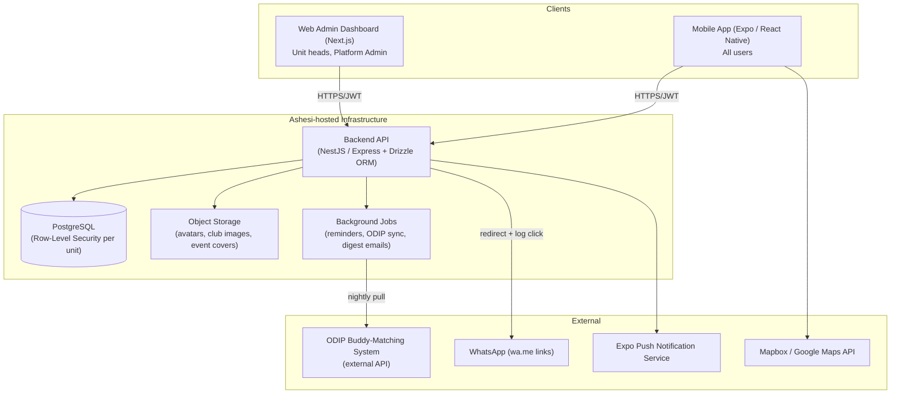
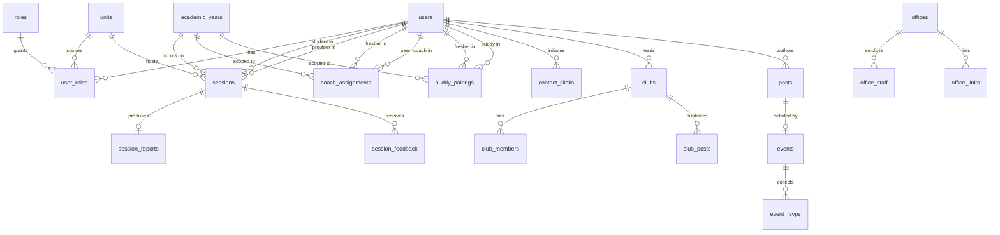

# Fresher Hub — Architecture, Database, Roadmap & Execution Plan

**Stack decisions locked in:** PostgreSQL (self-hosted on an Ashesi University server, for data-security/compliance reasons), Expo (React Native) for mobile, unified single-profile-per-user model with multiple roles attached. Target: **4-week build**, incremental, testable at every step.

---

## 1. Core Data Philosophy: Unified Profile

Every person is **one row in `users`**, created once (via the Ashesi IT/admissions data import), carrying a permanent `school_id` and `email`. **Every user starts with the `student` role.** Additional roles (`peer_coach`, `coach_admin`, `club_lead`, `staff`, etc.) are *added on top* of that base role, never replacing it — a club lead is still a student underneath, a peer coach is still a student underneath. This is what makes multi-role support low-friction: no separate signup, no separate account, no separate app experience — just more rows in `user_roles`.

This decision drives the entire schema below: roles are additive metadata on a single identity, not a fork in identity.

---

## 2. System Architecture

### 2.1 High-level diagram



### 2.2 Why this shape

- **Single backend API, two frontends** (mobile + web), same auth, same permission rules — no duplicated business logic.
- **PostgreSQL with Row-Level Security (RLS)** enforces unit confidentiality *in the database itself*, not just in application code. Even a bug in the API layer cannot leak a Coaching report to a Counselling head, because Postgres itself refuses the row.
- **Background job runner** handles the things that must happen without a user present: nightly ODIP pairing sync, session reminder pushes, mandatory-session compliance recalculation.
- **WhatsApp bridge as a redirect, not a raw link** — the API logs the "contact" click, then 302-redirects to `wa.me`, which is how click-tracking becomes possible without building chat.

### 2.3 Authentication — **✅ IMPLEMENTED**

> Last audited: 2026-07-20. See [`docs/AUTH_SECURITY_AUDIT.md`](./AUTH_SECURITY_AUDIT.md) for the full security review.

**Implementation status:** The full auth system is live in `apps/api` + `apps/mobile`.

#### Auth flow (as built)

| Flow | Endpoints | Status |
|---|---|---|
| Account activation (first login) | `check-email` → `request-otp` → `verify-otp` → `set-password` | ✅ Live |
| Login (returning user) | `check-email` → `login` | ✅ Live |
| Forgot password | `forgot-password` → `verify-reset-otp` → `set-new-password` | ✅ Live |
| Token refresh | `refresh` (auto-scheduled in app, 2 min before expiry) | ✅ Live |
| Logout | `logout` (revokes refresh token in DB) | ✅ Live |
| Change password (authenticated) | `change-password` (requires valid access token) | ✅ Live |
| Biometric login | Device biometric → SecureStore refresh token → `refresh` | ✅ Live |
| Profile update | `PUT /auth/profile` (requires valid access token) | ✅ Live |

#### Security posture
- **Accounts are pre-provisioned**, not self-registered — email must already exist in `users` from the admissions import. No open signup.
- **Password storage:** bcrypt via PostgreSQL `pgcrypto` (`crypt()` + `gen_salt('bf')`) — never stored plaintext.
- **JWT:** Custom HS256 implementation, 15-minute access token + 90-day refresh token stored as SHA-256 hash in DB.
- **OTP:** 6-digit, bcrypt-hashed in `activation_codes`/`password_resets`, 15-minute TTL, single-use.
- **Rate limiting:** In-memory per-action limits (login: 5/15 min; OTP: 3/hr; reset: 3/hr). **Switch to Redis before production.**
- **Account lockout:** 5 failed logins → 30-minute lockout. Duration non-extendable.
- **Biometric:** Tokens stored in `expo-secure-store` with `WHEN_UNLOCKED_THIS_DEVICE_ONLY` (device-bound keychain/keystore).
- **Role-based access:** `requireAuth` + `requireRoles` middleware enforced on protected routes.
- **Input validation:** Zod schemas on all auth routes, validated before controller logic.

#### Known pre-production fixes required
1. 🔴 Fix `checkAccountLockout` middleware call pattern in `authController.js` (currently called incorrectly — can cause double-response crash on locked accounts).
2. 🔴 Add OTP-consumed check to `handleSetPassword` (currently possible to set password without completing OTP step).
3. 🟡 Remove hardcoded test email in `login.tsx` (`"fresher.one@ashesi.edu.gh"`).
4. 🟡 Use `crypto.randomInt()` instead of `Math.random()` for OTP generation.
5. 🟡 Configure CORS to explicit origin list for production.
6. 🟡 Fail fast on missing `JWT_SECRET` in production instead of falling back to hardcoded default.
7. 🟡 Revoke all refresh tokens on password change/reset.

---

## 3. Database Schema (PostgreSQL)

Below is the full schema, grouped by domain. `uuid` primary keys throughout for safety across distributed inserts (mobile offline queues, imports, etc.).

### 3.1 Identity & Roles

```sql
CREATE TABLE users (
    id              UUID PRIMARY KEY DEFAULT gen_random_uuid(),
    school_id       TEXT UNIQUE NOT NULL,
    email           TEXT UNIQUE NOT NULL,
    full_name       TEXT NOT NULL,
    phone           TEXT,
    class_year      INT,               -- e.g. 2029 (graduation year)
    country         TEXT,
    major           TEXT,
    avatar_url      TEXT,
    is_active       BOOLEAN NOT NULL DEFAULT true,
    created_at      TIMESTAMPTZ NOT NULL DEFAULT now(),
    updated_at      TIMESTAMPTZ NOT NULL DEFAULT now()
);

CREATE TABLE roles (
    id      SERIAL PRIMARY KEY,
    name    TEXT UNIQUE NOT NULL   -- student, peer_coach, coach_admin, counselling_head,
                                    -- advisor, odip_head, staff, faculty,
                                    -- student_leader, club_lead, platform_admin
);

CREATE TABLE units (
    id      SERIAL PRIMARY KEY,
    name    TEXT UNIQUE NOT NULL   -- coaching, counselling, advising, buddy_up, clubs, platform
);

-- Every user gets 'student' automatically at import time.
-- Additional roles are added on top, optionally scoped to a unit.
CREATE TABLE user_roles (
    id          UUID PRIMARY KEY DEFAULT gen_random_uuid(),
    user_id     UUID NOT NULL REFERENCES users(id) ON DELETE CASCADE,
    role_id     INT NOT NULL REFERENCES roles(id),
    unit_id     INT REFERENCES units(id),          -- NULL for global roles (e.g. platform_admin)
    assigned_by UUID REFERENCES users(id),
    assigned_at TIMESTAMPTZ NOT NULL DEFAULT now(),
    UNIQUE (user_id, role_id, unit_id)
);

CREATE TABLE academic_years (
    id          SERIAL PRIMARY KEY,
    label       TEXT UNIQUE NOT NULL,   -- '2026/2027'
    start_date  DATE NOT NULL,
    end_date    DATE NOT NULL,
    is_current  BOOLEAN NOT NULL DEFAULT false
);
```

### 3.2 Support Units — Coaching / Counselling / Advising (shared shape)

All three units reuse the same `sessions` / `session_reports` / `session_feedback` tables, distinguished by `unit_id`. Coaching additionally uses `coach_assignments` for the mandatory peer-pairing; Counselling and Advising skip that table since there's no mandatory pairing.

```sql
CREATE TABLE coach_assignments (
    id                UUID PRIMARY KEY DEFAULT gen_random_uuid(),
    academic_year_id  INT NOT NULL REFERENCES academic_years(id),
    fresher_id        UUID NOT NULL REFERENCES users(id),
    peer_coach_id     UUID NOT NULL REFERENCES users(id),
    assigned_by       UUID NOT NULL REFERENCES users(id),  -- Coach Yvonne
    created_at        TIMESTAMPTZ NOT NULL DEFAULT now(),
    UNIQUE (academic_year_id, fresher_id, peer_coach_id)
);

CREATE TYPE session_status AS ENUM ('booked', 'completed', 'cancelled', 'rescheduled', 'no_show');
CREATE TYPE session_with AS ENUM ('peer_coach', 'unit_head');  -- e.g. peer coach vs Coach Yvonne directly

CREATE TABLE sessions (
    id                UUID PRIMARY KEY DEFAULT gen_random_uuid(),
    unit_id           INT NOT NULL REFERENCES units(id),      -- coaching / counselling / advising
    academic_year_id  INT NOT NULL REFERENCES academic_years(id),
    student_id        UUID NOT NULL REFERENCES users(id),
    provider_id       UUID NOT NULL REFERENCES users(id),     -- peer coach, counsellor, or advisor
    with_type         session_with,                           -- NULL for counselling/advising (n/a)
    scheduled_at      TIMESTAMPTZ NOT NULL,
    location          TEXT,
    status            session_status NOT NULL DEFAULT 'booked',
    is_mandatory      BOOLEAN NOT NULL DEFAULT false,
    created_at        TIMESTAMPTZ NOT NULL DEFAULT now(),
    updated_at        TIMESTAMPTZ NOT NULL DEFAULT now()
);

CREATE TABLE session_reports (
    id           UUID PRIMARY KEY DEFAULT gen_random_uuid(),
    session_id   UUID NOT NULL UNIQUE REFERENCES sessions(id) ON DELETE CASCADE,
    provider_id  UUID NOT NULL REFERENCES users(id),
    template_id  UUID REFERENCES report_templates(id),
    content      JSONB NOT NULL,       -- structured answers matching the template
    submitted_at TIMESTAMPTZ NOT NULL DEFAULT now()
);

CREATE TABLE report_templates (
    id          UUID PRIMARY KEY DEFAULT gen_random_uuid(),
    unit_id     INT NOT NULL REFERENCES units(id),
    name        TEXT NOT NULL,
    schema      JSONB NOT NULL,        -- field definitions: [{key, label, type}]
    is_active   BOOLEAN NOT NULL DEFAULT true
);

CREATE TABLE session_feedback (
    id           UUID PRIMARY KEY DEFAULT gen_random_uuid(),
    session_id   UUID NOT NULL REFERENCES sessions(id) ON DELETE CASCADE,
    student_id   UUID NOT NULL REFERENCES users(id),
    rating       SMALLINT CHECK (rating BETWEEN 1 AND 5),
    comment      TEXT,
    submitted_at TIMESTAMPTZ NOT NULL DEFAULT now()
);
```

> **Note on `report_templates` forward reference:** create `report_templates` before `session_reports` in actual migration order (shown here grouped by concept for readability).

### 3.3 Buddy Up (ODIP-sourced)

```sql
CREATE TABLE buddy_pairings (
    id                UUID PRIMARY KEY DEFAULT gen_random_uuid(),
    academic_year_id  INT NOT NULL REFERENCES academic_years(id),
    fresher_id        UUID NOT NULL REFERENCES users(id),
    buddy_id          UUID NOT NULL REFERENCES users(id),
    odip_ref_id       TEXT,             -- external ID from ODIP's system, for sync/dedupe
    synced_at         TIMESTAMPTZ NOT NULL DEFAULT now(),
    UNIQUE (academic_year_id, fresher_id, buddy_id)
);
```

### 3.4 WhatsApp Contact Tracking (shared across all units)

```sql
CREATE TABLE contact_clicks (
    id           UUID PRIMARY KEY DEFAULT gen_random_uuid(),
    initiator_id UUID NOT NULL REFERENCES users(id),
    target_id    UUID NOT NULL REFERENCES users(id),
    unit_id      INT REFERENCES units(id),     -- NULL if generic
    context      TEXT,                          -- 'buddy_up', 'coaching_peer', 'counselling', etc.
    clicked_at   TIMESTAMPTZ NOT NULL DEFAULT now()
);
```

### 3.5 Clubs

```sql
CREATE TABLE clubs (
    id           UUID PRIMARY KEY DEFAULT gen_random_uuid(),
    name         TEXT NOT NULL,
    description  TEXT,
    cover_url    TEXT,
    lead_id      UUID NOT NULL REFERENCES users(id),
    created_at   TIMESTAMPTZ NOT NULL DEFAULT now()
);

CREATE TABLE club_members (
    club_id    UUID NOT NULL REFERENCES clubs(id) ON DELETE CASCADE,
    user_id    UUID NOT NULL REFERENCES users(id) ON DELETE CASCADE,
    joined_at  TIMESTAMPTZ NOT NULL DEFAULT now(),
    PRIMARY KEY (club_id, user_id)
);

CREATE TYPE club_post_type AS ENUM ('announcement', 'event', 'update');

CREATE TABLE club_posts (
    id          UUID PRIMARY KEY DEFAULT gen_random_uuid(),
    club_id     UUID NOT NULL REFERENCES clubs(id) ON DELETE CASCADE,
    author_id   UUID NOT NULL REFERENCES users(id),
    type        club_post_type NOT NULL,
    content     TEXT NOT NULL,
    created_at  TIMESTAMPTZ NOT NULL DEFAULT now()
);
```

### 3.6 Feed, Groups & Events

```sql
CREATE TYPE post_type AS ENUM ('announcement', 'campus_update', 'event');
CREATE TYPE visibility_type AS ENUM ('public', 'targeted');

CREATE TABLE groups (
    id      UUID PRIMARY KEY DEFAULT gen_random_uuid(),
    name    TEXT NOT NULL,           -- 'Class of 2029', 'International Students', custom, etc.
    type    TEXT NOT NULL            -- 'class_year' | 'cohort' | 'custom'
);

CREATE TABLE group_members (
    group_id  UUID NOT NULL REFERENCES groups(id) ON DELETE CASCADE,
    user_id   UUID NOT NULL REFERENCES users(id) ON DELETE CASCADE,
    PRIMARY KEY (group_id, user_id)
);

CREATE TABLE posts (
    id          UUID PRIMARY KEY DEFAULT gen_random_uuid(),
    author_id   UUID NOT NULL REFERENCES users(id),
    type        post_type NOT NULL,
    visibility  visibility_type NOT NULL DEFAULT 'public',
    title       TEXT NOT NULL,
    body        TEXT,
    image_url   TEXT,
    created_at  TIMESTAMPTZ NOT NULL DEFAULT now()
);

CREATE TABLE post_targets (
    post_id      UUID NOT NULL REFERENCES posts(id) ON DELETE CASCADE,
    target_type  TEXT NOT NULL,     -- 'user' | 'group'
    target_id    UUID NOT NULL,
    PRIMARY KEY (post_id, target_type, target_id)
);

CREATE TYPE event_status AS ENUM ('scheduled', 'cancelled', 'completed');

CREATE TABLE events (
    id            UUID PRIMARY KEY DEFAULT gen_random_uuid(),
    post_id       UUID NOT NULL UNIQUE REFERENCES posts(id) ON DELETE CASCADE,
    event_date    DATE NOT NULL,
    event_time    TIME NOT NULL,
    location      TEXT,
    organizer     TEXT,
    dress_code    TEXT,
    capacity      INT,
    rsvp_enabled  BOOLEAN NOT NULL DEFAULT false,
    status        event_status NOT NULL DEFAULT 'scheduled'
);

CREATE TABLE event_rsvps (
    event_id   UUID NOT NULL REFERENCES events(id) ON DELETE CASCADE,
    user_id    UUID NOT NULL REFERENCES users(id) ON DELETE CASCADE,
    status     TEXT NOT NULL DEFAULT 'going',   -- going | maybe | declined
    rsvp_at    TIMESTAMPTZ NOT NULL DEFAULT now(),
    PRIMARY KEY (event_id, user_id)
);
```

### 3.7 Help Center

```sql
CREATE TABLE offices (
    id            UUID PRIMARY KEY DEFAULT gen_random_uuid(),
    name          TEXT NOT NULL,          -- 'ODIP', 'SLE', 'IT', 'Support Center', etc.
    description   TEXT,
    contact_email TEXT,
    contact_phone TEXT,
    location      TEXT
);

CREATE TABLE office_staff (
    office_id   UUID NOT NULL REFERENCES offices(id) ON DELETE CASCADE,
    user_id     UUID NOT NULL REFERENCES users(id) ON DELETE CASCADE,
    title       TEXT,
    PRIMARY KEY (office_id, user_id)
);

CREATE TABLE office_links (
    id          UUID PRIMARY KEY DEFAULT gen_random_uuid(),
    office_id   UUID NOT NULL REFERENCES offices(id) ON DELETE CASCADE,
    label       TEXT NOT NULL,     -- 'Web Print Portal'
    url         TEXT NOT NULL
);
```

### 3.8 FAQ, Notifications

```sql
CREATE TABLE faq_items (
    id          UUID PRIMARY KEY DEFAULT gen_random_uuid(),
    category    TEXT NOT NULL,
    question    TEXT NOT NULL,
    answer      TEXT NOT NULL,
    created_at  TIMESTAMPTZ NOT NULL DEFAULT now()
);

CREATE TABLE notifications (
    id              UUID PRIMARY KEY DEFAULT gen_random_uuid(),
    user_id         UUID NOT NULL REFERENCES users(id) ON DELETE CASCADE,
    category        TEXT NOT NULL,     -- 'session_reminder', 'club', 'announcement', 'compliance'
    title           TEXT NOT NULL,
    body            TEXT,
    related_entity  TEXT,              -- e.g. 'session:<uuid>'
    read_at         TIMESTAMPTZ,
    created_at      TIMESTAMPTZ NOT NULL DEFAULT now()
);

CREATE TABLE notification_preferences (
    user_id   UUID NOT NULL REFERENCES users(id) ON DELETE CASCADE,
    category  TEXT NOT NULL,
    enabled   BOOLEAN NOT NULL DEFAULT true,
    PRIMARY KEY (user_id, category)
);
```

### 3.9 Entity-Relationship Diagram (core)



### 3.10 Row-Level Security (confidentiality enforcement)

Sketch of the RLS pattern applied to `sessions`, `session_reports`, `session_feedback` (repeat per confidential table):

```sql
ALTER TABLE sessions ENABLE ROW LEVEL SECURITY;

-- Unit heads see only their unit's rows
CREATE POLICY unit_head_access ON sessions
    FOR SELECT
    USING (
        unit_id IN (
            SELECT ur.unit_id FROM user_roles ur
            JOIN roles r ON r.id = ur.role_id
            WHERE ur.user_id = current_setting('app.current_user_id')::uuid
              AND r.name IN ('coach_admin', 'counselling_head', 'advisor', 'odip_head')
        )
    );

-- Students/providers see only rows they're directly part of
CREATE POLICY own_session_access ON sessions
    FOR SELECT
    USING (
        student_id = current_setting('app.current_user_id')::uuid
        OR provider_id = current_setting('app.current_user_id')::uuid
    );

-- Platform admin explicitly gets NO policy granting row access here —
-- absence of a matching policy = no access, by design.
```

The API sets `app.current_user_id` per request (via `SET LOCAL` inside each transaction) after verifying the JWT. This means confidentiality is enforced **even if application code has a bug** — the database itself won't return rows outside policy.

---

## 4. Monorepo & Folder Structure

Using a Turborepo monorepo so the Expo app, web admin dashboard, and backend API share types and tooling.

```
fresher-hub/
├── apps/
│   ├── mobile/                    # Expo (React Native) app — all users
│   │   ├── app/                   # Expo Router file-based routes
│   │   │   ├── (auth)/
│   │   │   ├── (tabs)/
│   │   │   │   ├── feed/
│   │   │   │   ├── map/
│   │   │   │   ├── support/       # coaching, counselling, advising, buddy-up entry
│   │   │   │   ├── clubs/
│   │   │   │   └── help-center/
│   │   │   └── _layout.tsx        # role-aware nav shell reads from permissions config
│   │   ├── components/
│   │   ├── hooks/
│   │   ├── lib/
│   │   │   └── permissions.ts     # single source of truth: role -> visible screens/actions
│   │   └── app.json
│   │
│   ├── web-admin/                 # Next.js — unit heads + platform admin
│   │   ├── app/
│   │   │   ├── dashboard/
│   │   │   ├── coaching/
│   │   │   ├── counselling/
│   │   │   ├── advising/
│   │   │   ├── buddy-up/
│   │   │   ├── clubs/
│   │   │   ├── analytics/         # aggregate/anonymized only
│   │   │   └── users/             # platform admin: role management
│   │   └── components/
│   │
│   └── api/                       # NestJS (or Express) backend
│       ├── src/
│       │   ├── modules/
│       │   │   ├── auth/
│       │   │   ├── users/
│       │   │   ├── roles/
│       │   │   ├── sessions/       # coaching/counselling/advising shared logic
│       │   │   ├── buddy-up/
│       │   │   ├── clubs/
│       │   │   ├── feed/
│       │   │   ├── help-center/
│       │   │   ├── notifications/
│       │   │   ├── contact-tracking/ # WhatsApp redirect + click logging
│       │   │   └── analytics/
│       │   ├── jobs/                # cron: reminders, ODIP sync, compliance recalculation
│       │   └── main.ts
│       └── test/
│
├── packages/
│   ├── db/                        # Drizzle ORM schema + migrations (the SQL above, as Drizzle schema)
│   │   ├── schema/
│   │   └── migrations/
│   ├── types/                     # shared TypeScript types (User, Role, Session, etc.)
│   ├── ui/                        # shared design tokens/components where feasible
│   └── config/                    # eslint, tsconfig, tailwind config shared across apps
│
├── .github/
│   ├── ISSUE_TEMPLATE/
│   │   ├── feature.md
│   │   └── bug.md
│   └── workflows/
│       ├── ci.yml                 # lint, typecheck, test on PR
│       └── deploy.yml             # deploy api + web-admin to Ashesi server on merge to main
│
├── turbo.json
├── package.json
└── README.md
```

---

## 5. Four-Week Roadmap — Build in Add-On, Testable Increments

**Rule for every single step below: it includes schema + API + a real UI screen, together, in the same step.** Nothing is "backend this week, frontend later" — that's what made the earlier version feel disconnected (it promised a login and tab-bar demo at the end of Week 1 while all of Week 1's steps were backend-only). Each step is sized to roughly one working day, 5 steps per week, so progress is checkable day-by-day, not just at week boundaries.

### Week 1 — Foundations: a real login and a real (if empty) home screen

| Day | Step | What gets built (DB + API + UI, together) | What you can literally do at end of day | Status |
|---|---|---|---|---|
| 1 | Repo + schema bootstrap | Turborepo scaffold; identity tables (`users`, `roles`, `units`, `user_roles`, `academic_years`) migrated onto real Postgres; seed script with fake users, mixed roles | Connect to the DB with a client, see real seeded rows with roles attached | ✅ Done |
| 2 | Auth backend | `credentials`/`refresh_tokens`/`activation_codes`/`password_resets` tables; full auth API: login, OTP activation, forgot-password, refresh, logout, change-password, update-profile; bcrypt passwords via pgcrypto; custom HS256 JWT; in-memory rate limiter + account lockout; Zod validation on all routes | Hit `/auth/login` with curl using a seeded user, get back a real JWT and refresh token | ✅ Done |
| 3 | Mobile: full auth screens | Expo app: login screen (email → password two-step), OTP activation screen (6-box input), forgot-password → reset-password flow, rate-limit/lockout screen; biometric login via `expo-local-authentication`; `expo-secure-store` for biometric session; `AsyncStorage` for regular session; auto-refresh timer (2 min before expiry); route guard in `_layout.tsx` | Open the app on a phone, type a seeded user's email, go through OTP activation, set a password, land on home; enable Face ID/fingerprint in settings, log out, log back in with biometrics | ✅ Done |
| 4 | Role-aware navigation shell | `permissions.ts` config; tab bar renders different tabs based on the roles returned at login; a placeholder screen per tab (title only, no data yet) | Log in as a plain `student` → see Feed/Map/Support/Clubs tabs. Log out, log in as a `club_lead` → see an extra "My Club" tab. Real difference, real login, on your phone. | ✅ Done |
| 5 | CI + RLS foundation | GitHub Actions (lint/typecheck/test on PR); enable RLS on `users`/`user_roles` with a first working policy | A broken PR fails CI automatically; a manual SQL query as "user A" cannot read "user B"'s role row | 🔲 Pending |

**Week 1 exit demo:** Days 1–4 are complete. Two people can log into the real app on their own phones with their own seeded accounts, go through OTP activation, log in with password or biometrics, see role-appropriate tab bars, backed by a live Postgres instance. Day 5 (CI + RLS) is the remaining piece.

### Week 2 — Core information layer (the tabs get real content)

| Day | Step | What gets built | What you can literally do at end of day |
|---|---|---|---|
| 6 | Help Center | `offices`/`office_staff`/`office_links` tables + API + mobile list screen + detail screen; seed 3–4 real Ashesi offices | Open Help Center tab, tap "ODIP", see its real description/contact/staff |
| 7 | FAQ + Search | `faq_items` table + API + searchable list UI | Type "hostel" in search, see a matching seeded FAQ answer |
| 8 | Campus Map | Map integration (Mapbox/Google Maps) + pinned buildings + tappable pin detail | Open Map tab, see the actual campus with 5+ real pinned buildings, tap one for info |
| 9 | Feed: announcements + campus updates | `posts` table + API with role check (staff/faculty/student_leader/admin can post, student cannot) + feed list UI + "new post" screen (only visible to allowed roles) | Log in as staff, post an announcement, see it appear in the feed; log in as a student, confirm no "+" post button appears and a direct API call is rejected too |
| 10 | Groups, targeted posts, events, notifications wiring | `groups`/`group_members`/`post_targets`/`events`/`event_rsvps`/`notifications` + UI: event card with RSVP button; push notification on new targeted post | Post an event targeted at "Class of 2029" only; log in as a 2029 student, see and RSVP to it; log in as a different class year, confirm it's absent; receive a real push notification |

**Week 2 exit demo:** a fresher opens the app cold, browses the Help Center, checks the map to find a building, sees a class-specific event in their feed, RSVPs, and gets a push notification confirming it — all real screens, real data, real device.

### Week 3 — Support units (the confidential core — highest-risk week)

| Day | Step | What gets built | What you can literally do at end of day |
|---|---|---|---|
| 11 | Sessions schema + RLS + Coaching booking UI | `sessions`/`report_templates`/`session_reports`/`session_feedback`/`coach_assignments` tables + RLS policies; mobile screen: fresher sees assigned peer coach's profile + "Book a session" flow | Log in as a fresher with a seeded coach assignment, book a real session, see it land in Postgres with the correct `unit_id` |
| 12 | Coaching: compliance view (both sides) | Fresher-facing progress checklist UI ("1 of 3 sessions complete"); Coach Yvonne's mobile dashboard listing her assigned freshers + status | Mark a session `completed` via the app, watch the fresher's checklist update and Yvonne's dashboard reflect it |
| 13 | Report submission + WhatsApp bridge | Peer coach report screen (driven by `report_templates` JSON schema); `contact_clicks` table + redirect endpoint + "Contact via WhatsApp" button wired into the Coaching screen | Submit a real structured report after a session; tap the WhatsApp button and confirm both the click log and WhatsApp actually opening with the right number |
| 14 | Counselling + Advising modules | Same `sessions` UI pattern reused/adapted: counselling screen (self-book, multiple heads), advising screen (2 advisors, no mandatory tracking) + confirm RLS isolation in the running app, not just via raw SQL | Log in as a counselling head, confirm the Coaching sessions from Days 11–13 are invisible in their dashboard, and vice versa |
| 15 | Buddy Up + reminders | `buddy_pairings` + mocked ODIP sync job + mobile Buddy Up screen (assigned buddy profile + WhatsApp button); cron job for session reminders | Run the mock sync, see a buddy pairing appear on a fresher's Buddy Up screen; schedule a session for "tomorrow," confirm a reminder notification fires |

**Week 3 exit demo:** the full human loop, on real screens — fresher assigned a coach → books → gets reminded → session happens → coach reports → fresher gives feedback → Yvonne's dashboard updates — while a counselling head, logged in alongside, sees none of it.

### Week 4 — Clubs, Web Admin, Analytics, Deployment

| Day | Step | What gets built | What you can literally do at end of day |
|---|---|---|---|
| 16 | Clubs | `clubs`/`club_members`/`club_posts` + mobile: browse clubs, instant-join, club page with its own mini-feed | Join a club with one tap, see its dedicated feed, post as club lead, confirm it doesn't leak into the main Feed |
| 17 | Web admin dashboard shell + Coaching compliance (web) | Next.js app, shared JWT auth, role-gated routes; full filterable compliance table (by cohort/status/overdue) | Log into the web dashboard as Coach Yvonne on a laptop, filter "Class of 2029, incomplete," get the right list; a student account gets denied at the route level |
| 18 | Counselling/Advising/Buddy Up web views | Same admin pattern extended to the remaining units, each scoped to its own head role | Log in as an ODIP head on web, see only Buddy Up data; confirm no cross-unit visibility, same as mobile |
| 19 | Aggregate analytics (anonymized) | Materialized views (completion speed by class year, unit engagement rates) + admin analytics screen with a real chart | Platform admin views a chart comparing average days-to-completion across class years — with no student names anywhere on that screen |
| 20 | Notification preferences, QA pass, deployment | Per-category notification toggle UI; full manual test script across every role × module; deploy API + Postgres + web to the Ashesi server, submit Expo build via EAS | Toggle off "club" notifications and confirm session reminders still arrive; install the production build on a real device and complete one full journey end-to-end, on Ashesi's own infrastructure |

**Week 4 exit demo:** a complete, installable app plus a working web dashboard, both live on Ashesi's server, walked through role by role, front-to-back, with nothing "still to be wired up."

---

## 6. GitHub Project Tracking Setup

### 6.1 Repository structure
- One repo (`fresher-hub`) housing the monorepo above — keeps issues, PRs, and code in one place, since mobile/web/api are tightly coupled through shared schema/types.

### 6.2 Milestones (map directly to the 4 weeks)
- `Week 1 — Foundations`
- `Week 2 — Core Info Layer`
- `Week 3 — Support Units`
- `Week 4 — Clubs, Admin, Launch`

### 6.3 Labels

| Label | Purpose |
|---|---|
| `area:mobile` / `area:web` / `area:api` / `area:db` | Which part of the stack |
| `unit:coaching` / `unit:counselling` / `unit:advising` / `unit:buddy-up` / `unit:clubs` | Which support unit |
| `type:feature` / `type:bug` / `type:chore` / `type:docs` | Kind of work |
| `priority:p0` / `p1` / `p2` | Urgency |
| `confidentiality-critical` | Flags anything touching RLS/unit data isolation — extra review required |

### 6.4 Issue template (`.github/ISSUE_TEMPLATE/feature.md`)

```markdown
---
name: Feature
about: A single testable increment from the roadmap
labels: type:feature
---

**Roadmap ref:** (e.g. Week 3 / 3.3 — Coaching compliance dashboard)

**What this delivers:**


**Acceptance criteria (must be testable):**
- [ ]
- [ ]

**Touches confidential data?** yes/no — if yes, tag `confidentiality-critical` and confirm RLS policy covers it.
```

### 6.5 Project Board (GitHub Projects)
Columns: `Backlog → Ready → In Progress → In Review → Done`.
Every **Day** row in the Week 1–4 tables above becomes one GitHub Issue (so ~20 issues total for the core build, plus any bugs filed during QA), added to the board and assigned to its Milestone. This gives you:
- A **burndown view** per week (are you on pace for the 4-week target — roughly one issue closed per working day?)
- A single place to see what's blocking what (e.g., Day 15's Buddy Up sync depends on Day 11's `sessions`/RLS foundation being merged first)
- Clear "exit demo" checkpoints at the end of each week to catch drift early

### 6.6 Suggested working rhythm
- Daily: move one card at a time through the board; avoid starting a new step before the previous one passes its test criteria — this is what keeps the "add-on, testable" property real rather than aspirational.
- End of each week: run that week's "exit demo" against the actual app before starting the next week's issues.
- Any issue that touches a confidential table (`sessions`, `session_reports`, `session_feedback`, `buddy_pairings`) gets a mandatory RLS check before merge — this is the single highest-risk area for a silent confidentiality bug.

---

## 7. Risk Notes Worth Carrying Into Week 1

1. **RLS correctness is the make-or-break constraint.** Confidentiality was stated as non-negotiable across every unit — invest real test-writing time on Day 11 specifically (automated tests that assert cross-unit access is denied), not just manual spot checks.
2. **ODIP's API shape is unknown until you get access.** Day 15 should start against a mocked endpoint so Week 3 isn't blocked waiting on ODIP; swap in the real integration once available.
3. **Admissions data import (Day 2) is a hard dependency for almost everything else** — prioritize getting a real (or realistic sample) CSV from IT as early as possible in Week 1, even before the format is finalized, so the import script isn't guessing at fields.
4. **4 weeks is tight for this scope.** If Week 3 (the most complex week) slips, the safest place to cut is **Day 19 (analytics)** or trimming the Day 17–18 web admin filters — not the confidentiality/RLS work, and not the core coaching/counselling/advising loop, since that's the platform's actual value.

---

*This document is the execution companion to `Fresher_Hub_Project_Description.md` and should be read alongside it — this file answers "how and in what order," the other answers "what and why."*